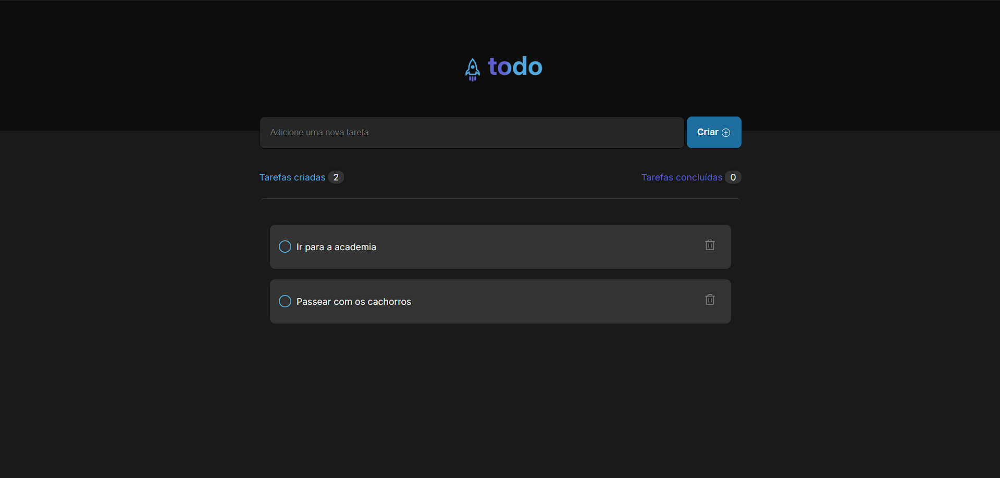

#ToDO List App

## Descrição

Este é um aplicativo simples que funciona como uma lista de tarefas
desenvolvido em React. O objetivo do projeto é permitir que os usuários
possam adicionar, marcar como concluídas e excluir tarefas de forma intuitiva.
É uma aplicação básica ideal para iniciantes em React ou para quem deseja
entender os conceitos de gerenciamento de estado em aplicações de frontend.

## Funcionalidades

- Criação de novas tarefas
- Conclusão de tarefas
- Exclusão de tarefas realizadas
- Contador de tarefas criadas e realizadas



## Objetivo do projeto

O objetivo da criação deste projeto, é por a prova os conhecimentos básicos dos
estudos de React, como a componentização, o gerenciamento de estados, a
renderização condicional, modularização de estilos, passagem de props por
parâmetros de funções etc.

## Instalação

Para executar este projeto localmente, siga as instruções abaixo:

1. Clone o repositório:

```bash
git clone https://github.com/gustabcc/ToDoList.git

```

2. Navegue até o diretório do projeto

```bash
 cd ToDoList
```

3. Instale as dependências

```bash
 npm i ou npm install
```

4. Execute a aplicação

```bash
 npm run dev
```
